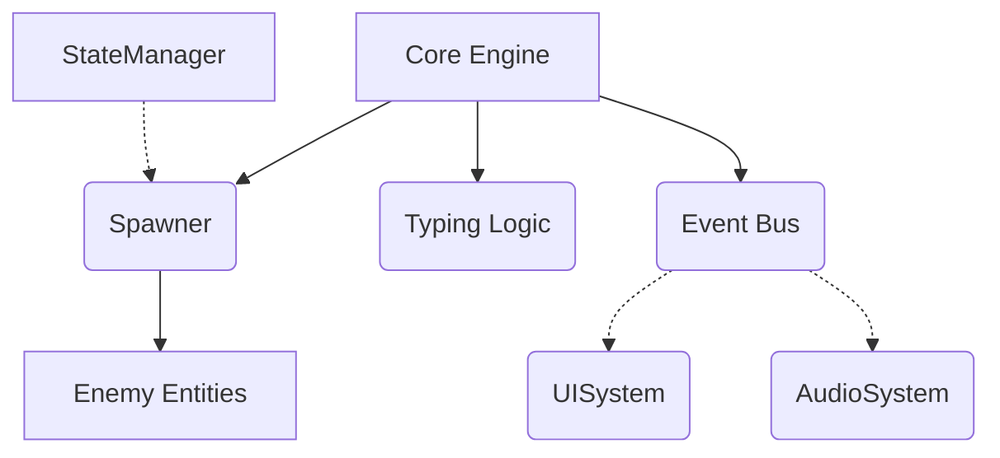

# DAKEN! ( Neon Typing Arcade) 🕹️🥷✨

Một dự án Web Game Luyện gõ phím & Trí nhớ mang âm hưởng **Lofi Cyber-Oriental (Á Đông Cổ Phong pha trộn Cyberpunk)**. Trải nghiệm hóa thân thành Ninja vi mạch chém bay các chuỗi từ vựng giữa một màn đêm không gian mạng ngập rạng rỡ với những hồ cá Koi dạ quang thư giãn. Vừa xả stress vừa tiếp thu tiếng Nhật sâu thẳm qua Study Mode (Tàng Kinh Các)!

---

## Tính Năng Nổi Bật 🚀

- **Luồng Gõ Đạt Chuẩn Thuật Toán**: Typing matching chính xác đến từng Kí Tự Phụ Âm, hỗ trợ target-lock (Khóa mục tiêu dựa trên chữ cái đầu tiên).
- **Hệ Sinh Thái Study Mode**:
  - Không chỉ luyện tay, bạn sẽ đối đầu với khối dữ liệu từ vựng khổng lồ (Kanji + Nghĩa Việt + Romaji).
  - Tích hợp tính năng Furigana tự động và diễn giải Ngữ Pháp (Grammar).
  - Khám phá cơ chế "Death Delay" (The Ah-ha! Moment): Giấu kín bộ nhớ, ép buộc truy xuất và lật đáp án rực rỡ trong 6 giây tĩnh lặng ngay khi gõ xong (kèm quyền Skip siêu tốc bằng Spacebar).
  - **Cơ chế Dual-Stack Contextual Memory (Wave 2)**: Bạn sẽ phải gõ ngẫu nhiên không báo trước 2 chiều truy xuất: Nhìn Kanji gõ Romaji hoặc Nhìn Nghĩa Tiếng Việt gõ Romaji. Các công cụ nhắc tuồng tinh vi giúp não bạn đổ mồ hôi thực sự để ghim từ vựng vào sâu tiềm thức!
  - **Cơ chế Retry Không Khoan Nhượng (Anki Red Stacks)**: Mọi sự do dự hay buông xuôi đều bị ghim cờ "Weak" và vứt vào một Vòng Lặp Vay Nợ. Khi Wave kết thúc, hệ thống ép bạn xử lý khoản nợ đỏ rực kia cho tới khi vượt qua chính mình.
  - **Cơ chế Trừng Phạt Bầy Đàn (Swarm Mode - Wave 3)**: Đây là nơi thanh toán ân oán. Mọi khoản "nợ đỏ" sinh sôi thành bầy cá (clones). Đặc biệt, hệ thống **Viewfinder Khóa Mục Tiêu (Hardcore Lock-on)** ép bạn phải ngắm bắn chuẩn xác theo thứ tự, gõ chệch mục tiêu sẽ bị tịch thu phím và trừ sạch Combo!
  - **Ma Trận Trắc Nghiệm Ngữ Pháp (Wave 4 - Đã hoàn thiện)**: Bài thi tàn nhẫn và tốc độ nhất! Đóng vai trò là chuỗi bài Contextual Choice chắp vá cấu trúc câu thông qua cụm Ô Trống `[ ]`. Các Flashcard tĩnh được nhồi cơ chế Render Font tự thu phóng (Auto-scaling), chắt lọc Furigana tinh tế bên trong Canvas và chốt chặn điểm rơi thông minh (Safe-area margin). Xóa bỏ cách gõ phím thông thường, áp dụng hoàn toàn Căn Chỉnh Phím Tắt (Hotkeys 1->4) tạo cảm giác Instant Kill tràn ngập Dopamine! Thả quái sai rơi ngay vào hàng đợi Học Lại (Stack), đồng thời thuật toán tự triệt tiêu biến ảnh (Ghost Text) kích hoạt giải phóng thẻ Terminal rộng tối đa giúp đọc mượt những định nghĩa ngữ pháp từ vựng siêu dài.
- **Tính năng Tổng Ôn & Tích Chọn Wave (Unit Revision)**:
  - Cho phép người học ôn tập toàn bộ từ vựng của một Unit bất kỳ. Hệ thống sẽ tự động tổng hợp tất cả các phiên học (Sessions) thành một chiến dịch duy nhất.
  - **Lựa chọn Wave linh hoạt**: Bạn có quyền "tích chọn" chính xác những Wave muốn luyện tập (từ W1 đến W5). Thích luyện sinh tồn? Chỉ việc tích ô W5 và nhảy thẳng vào trận chiến! Toàn bộ Gameplay nay tuân thủ tuyệt đối cấu hình `workflow`, đảm bảo các Wave bị vô hiệu hóa sẽ được ẩn thực thể hoàn toàn.
  - **Kiến trúc Ôn tập Cộng dồn (Cumulative Review)**: Nâng cấp cốt lõi lưu trữ sang cơ chế `session_idx` âm dựa trên timestamp. Điều này cho phép bạn tích lũy điểm số Review vô tận qua nhiều lượt chơi mà không bao giờ bị ghi đè dữ liệu cũ.
  - **Review Score Statistics**: Điểm số từ quá trình ôn tập được lưu trữ riêng biệt và hiển thị trên thẻ Profile với sắc **Tím (Purple #a855f7)** sang trọng, giúp bạn theo dõi nỗ lực "trui rèn" mà không làm nhiễu loạn bảng xếp hạng chính.
- **Tùy Chỉnh Tổng Ôn Cá Nhân Hóa (Dynamic Review Customization)**:
  - **Thanh trượt Số lượng Từ**: Cho phép đặc vụ tự tay điều chỉnh quy mô phiên ôn tập (từ 5 đến toàn bộ kho từ vựng của Unit) thông qua Slider linh hoạt. Bạn có thể chọn học siêu tốc 5 từ, hoặc cày cuốc 100 từ để bứt phá giới hạn.
  - **Điểm Mục Tiêu Năng Động (Dynamic Target Score)**: Đập bỏ mốc 3000 điểm cố định. Hệ thống tự động tính toán "Mốc Chiến Thắng" (Victory Threshold) dựa trên số lượng từ bạn chọn theo công thức Căn bậc hai Cyber. Ví dụ: 50 từ cần 3000đ, nhưng 100 từ sẽ cần tới 4500đ để hoàn thành Wave 5!
  - **Thông Tin Tình Báo Trước Trận (Pre-match Intel)**: Ngay khi điều chỉnh Slider, thông tin **TARGET REVIEW SCORE** (màu Vàng Gold) sẽ hiển thị tức thì, giúp bạn định hình chiến lược để đạt Rank cao nhất.
- **Identity UI "Zen Night" (Thẻ Căn Cước Đặc Vụ)**: 
  - **Giao diện Cân bằng Bát Quái**: Tổng điểm (Green #00e676) và Điểm Ôn tập (Purple #a855f7) được thiết kế đối xứng hoàn mỹ trong các hộp dập nổi (Embossed Boxes), tạo nên sự hài hòa tuyệt đối giữa Tiến trình mới và Thành quả cũ.
  - **High-Contrast Agent ID**: Mã số định danh (#ID) được rèn lại với màu Trắng tinh khiết (`#ffffff`) phả hào quang Cyan, rực sáng và sắc nét trên mọi điều kiện ánh sáng của màn đêm Cyber-Zen.
  - **Cơ chế Cắt tên Thông minh (Auto-truncation)**: Tên đặc vụ dù dài đến đâu cũng sẽ được gói gọn tinh tế bởi dấu `...` và hệ thống Tooltip ẩn hiện, giải phóng không gian cho ID và Rank luôn nằm ở vị trí trang trọng nhất.
- **Trạng Thái Ngưng Đọng Tuyệt Đối**: Cảm giác trải nghiệm tiệm cận AAA. Bấm Stop - toàn bộ Vũ trụ Game (Thời gian và Nhạc nền YouTube) lập tức đóng băng. Bấm Tiếp tục - đếm ngược 3-2-1 bùng nổ để bạn vào lại nhịp Flow State mượt nhất.
- **Dynamic HUD Float Engine**: Sự kết hợp tinh tế của toán học và DOM API. Bảng thông tin siêu meta (Kanji, Nghiã, Ngữ pháp...) được Neo cứng ở nửa dưới màn hình để chừa không gian trống tuyệt đối cho Vùng Gõ Phím. Những Viên Thuốc từ vựng được điều khiển bởi thuật toán đo tọa độ vật lý thời gian thực, đảm bảo luôn bay lơ lửng, giữ khoảng cách an toàn tuyệt đối 15px so với mép trên của bảng thông tin, bất chấp nội dung bên trong bảng có phình to ra như thế nào. Trí tuệ tuyệt đối vào từng khung hình.
- **Web Component UI Ecosystem**: Kiến trúc Dashboard chia tách hoàn toàn bằng Vanilla ShadowDOM (Cột Mộc Ấn Avatar, Phong Thần Bảng Rank eSports, và Hệ thống Side-Banner Sự kiện trượt tự động). Tự động tính toán không gian co giãn chiều cao theo màn hình người chơi (`calc(100vh)`) để tuyệt đối không xảy ra hiện tượng chồng lấp.
- **Nested Radial & Fan-out Panel UI**: Đập bỏ hoàn toàn giới hạn ô menu chữ nhật truyền thống. Dựng đứng màn hình chính (Landing Focus) dưới dạng "Trọng Lõi" khổng lồ (`打検`) của `osu!` đặt giữa rải ngân hà 3 vòng tròn quỹ đạo đồng tâm Neon. Hệ thống Chọn chế độ chuyển sang cấu trúc Bệ phóng (Orbit Buttons). Tinh tế nhất là tuyệt kỹ "Bo Viền" Cánh quạt Study: Cưỡng chế thẻ chứa chữ ngược góc xoay (Anti-gravity string) tạo cảm giác không trọng lực đỉnh cao. Đặc biệt, hệ thống trang bị tính năng chống "Ghost Hover" tuyệt đỉnh, sử dụng "cầu nối tàng hình" SVG để triệt tiêu mọi khe hở quang học giữa các nan quạt phụ, phối hợp cùng bộ Đếm Debounce siêu nhỏ để quạt co rút mượt mà, giữ trọn tỉ lệ vàng trên mọi khung hình mà không lo nhấp nháy chuyển trạng thái vô duyên.
- **Lofi Cyber-Bamboo N2 Hub**: Lột xác hoàn thiện hằng số của JLPT N2 Hub. Gột rửa mảng mảng ô hộp (Boxy Frame), ban phát linh hồn "Tàng Kinh Các" - thiết kế Header lấy cảm hứng từ thẻ tre "Cuộn Trúc Thư". Tái hiện ấn triện thư pháp Mặc Tích [ 二級 ]. Hệ thống hiển thị Chỉ Số Stats thu gọn về chuẩn Minimalist Zen `|` đi kèm trải nghiệm tương tác (Sliding Brush Hover) trên nút Trở Về Sảnh, giúp không gian học tập hòa vào triết lý Tĩnh Tâm tuyệt đối. Toàn bộ Rank trên Hub được đồng bộ hoá 100% với hệ thống điểm thật (Score-based Rank) giúp ghi nhận công bằng nỗ lực của người học.
- **Tính Kiên Định Âm Nhạc & Chấm Điểm N2 Thực Tế**: Xóa bỏ khái niệm đứt gãy Audio - thanh thu gọn Mini Music Player bám trụ kiên cường ở mọi màn hình để giữ trọn Lofi Flow. Đặc biệt, bộ đếm N2 Hub nay chấm dứt việc dùng điểm giả lập (Simulated Acc*WPM), bắt tay lấy thẳng Real Score kết tinh từ màn chơi. Chào đón dàn HUD hiển thị "SCORE" rực sáng trên từng nan cuộn Session gộp kèm hệ thống Tiến Trình Trực Quan (Wave Progress Bar, % Tracking, Retry Queue) giúp vắt kiệt và tối ưu hiệu suất ghi nhớ!
- **Summary Modal Zen-Polish**: Bảng tổng kết cuối trận được tinh giản hoá, loại bỏ Synapse Chart rườm rà. Kích thước 600px chuẩn mực, layout chuyên nghiệp tập trung duy nhất vào thành quả: Thứ hạng (Rank), Tổng điểm và độ thuần thục Mastery.
- **Onboarding Protocol & Manual System**: Một hệ thống "Thư viện Protocol" chuyên nghiệp (`?` icon) được tích hợp ở góc màn hình, giúp người chơi dễ dàng nắm bắt chiến thuật của từng Wave bất cứ lúc nào. Đặc biệt tính năng tự động nhắc Protocol sau khi Đăng Nhập giúp người mới không bao giờ lạc lõng giữa ma trận dữ liệu.
- **Direct Neural Feedback**: Tích hợp hệ thống gửi góp ý trực tiếp qua EmailJS. Người dùng có thể đóng góp ý kiến xây dựng Zen-World ngay trong game mà không làm gián đoạn trải nghiệm âm nhạc hay gõ phím, nhờ thuật toán Input Isolation thông minh.
- **Neuro-Kinetic Movement Engine (Fast & Sparse Physics)**: Đột phá trong vật lý di chuyển. Gameplay giờ đây được cân bằng bởi thuật toán `Fast & Sparse`, tạo ra những thực thể quái vật di chuyển với tốc độ x5.5 nhưng mật độ giãn cách cực thoáng (x0.12). Đảm bảo sự mượt mà tuyệt đối trên mọi loại màn hình (60Hz -> 240Hz+).
- **Admin Feedback Terminal**: Khoang điều khiển bí mật dành riêng cho nhà phát triển. Hệ thống cho phép truy xuất trực tiếp và quản lý hòm thư phản hồi từ Supabase, tích hợp cơ chế Xóa (Delete) vĩnh viễn với bảo mật RLS Policy.
- **Supabase High-Res Asset Storage**: Nâng tầm cá nhân hóa với Supabase Storage. Avatar giờ đây hỗ trợ dung lượng lên tới 2MB, được lưu trữ và truyền tải qua hệ thống Public URL tốc độ cao, đảm bảo hiển thị sắc nét trên toàn cầu.
- **Bản địa hoá Song ngữ & Ghi nhớ Trạng thái**: Tích hợp hoàn hảo hệ thống chuyển đổi ngôn ngữ Anh - Việt. Trò chơi không chỉ tự động dịch mọi thành phần UI (Trở về sảnh, Năng lượng, Trạng thái...) mà còn sở hữu "trí nhớ ngắn hạn" thông qua `localStorage`, đảm bảo lựa chọn ngôn ngữ của bạn luôn bền vững sau mỗi lần tải lại trang.
- **Tối ưu hóa Chuyển cảnh (Zero-Flicker Transition)**: Loại bỏ triệt để hiện tượng nháy trắng 0.2s khi thoát trận. Hệ thống giờ đây sử dụng các "chốt chặn trạng thái" (State Guards) và ép buộc ẩn các modal trung gian ngay lập tức để đảm bảo trải nghiệm quay về sảnh mượt mà như một dòng chảy duy nhất.
- **Kiến trúc JLPT Đa Tầng & Hệ số Điểm Cân Bằng (v0.11.0)**:
  - **Đa cấp độ N1-N5**: Dự án đã chính thức hỗ trợ toàn bộ các cấp độ JLPT. Dữ liệu học tập được cô lập theo nhãn (Level-tag), cho phép học nhiều cấp độ song song mà không bị trộn lẫn hay ghi đè.
  - **Hệ số Công bằng (Score Scaling Factor)**: Thuật toán điều tiết điểm số dựa trên mốc chuẩn 20 từ. Bài học ngắn sẽ được tăng kịch tính bằng điểm số cao, bài học dài sẽ được giãn biên độ điểm số, giúp Rank S luôn giữ giá trị thực. (Lưu ý: Chỉ áp dụng cho chế độ Học, chế độ Tổng ôn nhận Full điểm).
  - **Chuẩn hóa Accuracy Precision**: Hệ thống tự động nhận diện và chuyển đổi thông minh giữa dữ liệu thập phân từ Database và hiển thị phần trăm trên UI, triệt tiêu hoàn toàn các con số "ảo" lệch pha hàng ngàn lần.
- **Tùy Chỉnh Âm Nhạc Bất Tận**: Nhúng trực tiếp Youtube Lofi Player với Playlist HUD riêng biệt, cho phép lưu trữ Local Storage các folder bài hát mà bạn thích nhất!
- **Hệ Sinh Thái Âm Thanh & Text-To-Speech (TTS)**: 
  - Mọi "Kẻ địch" bị hạ gục trong Study Mode sẽ được xướng danh bằng hệ thống tự động đọc (Web Speech API chuẩn giọng ja-JP) lướt sâu vào đại não.
  - Tích hợp **Bảng Điều Khiển Master Audio Mixer** dạng kính mờ (Glassmorphism) cực lãng mạn. Trượt tay chia rẽ các cõi âm: Giọng Đọc (Vocals), Nhạc Nền (BGM), Hiệu Ứng (SFX) & Tốc Độ Truyền Âm.
  - **Ducking Volume**: Điệu nhảy nhịp nhàng của âm thanh. Tiếng nhạc Lofi lùi bước nhẹ bằng 20% khi bản tin bài đọc được xướng lên, chừa khoảng trống cho tư duy, và tự động dâng trào 70% trở lại vào những quãng nghỉ trứ danh.

## Stack Thần Thánh Xây Lên Game 💻

- **Vite + TypeScript**: Chạy lướt sóng, không lỗi lầm. Build gọn nhẹ tốc độ bàn thờ.
- **Vanilla Canvas API**: Xử lý logic vòng lặp Engine 60FPS mượt mà, tối ưu DOM repaint.
- **CSS3 Animations**: Glassmorphism, Hiệu ứng nhiễu sóng UI, Viền dạ quang Cyberpunk.
- **Node.js Scripts (Automation)**: Cào và tinh chỉnh Regex xử lý Ruby text cực mượt.

## Kiến Trúc Hệ Thống (Architecture) 🏗️



- Tuân thủ nguyên lý Tách Biệt Mối Quan Tâm (Separation of Concerns). `UISystem`, `AudioSystem` hoàn toàn độc lập với `Engine`, giao tiếp ẩn danh thông qua `EventBus`.
- Quái vật chỉ thuần túy chứa hitbox họa hình, toàn bộ Data DOM phức tạp được nhường việc cho "HUD Terminal" xử lý tĩnh.
- **AI Data Architect Pipeline**: Tích hợp luồng tạo Data độc lập bằng Node.js (`ai_data_builder.js`). Giao thức mới đã tiễn đưa giới hạn 12 Unit, vươn tầm giải mã trọn vẹn **15 Hệ Cấu Trúc Ngôn Ngữ (Units)** cho kỳ thi N2. Dữ liệu giờ được bọc trong ma trận đa tầng tĩnh (Level -> Unit -> Vocab). Khả năng tự động cắm rễ `Kuroshiro` & `Kuromoji` bóc tách Furigana `{Kanji|Kana}` trực tiếp. Cơ chế Auto-Recovery giúp vượt bão Rate Limits, gánh vác toàn bộ mảng dữ liệu để nhường não bộ cho Game Balance!
- **Hệ Sinh Thái Phản Thể AI (.agent/memory)**: Được xây dựng với quy luật tự tiêu thụ Workflows nội bộ. Hệ thống AI Agent được quy hoạch thư mục chuyên biệt để duy trì Trạng Thái Handoff, Kịch Bản Game (GDD), và Pitch Deck một cách hoàn toàn tự động thông qua luồng `/all_in_one` thần thánh.

## Cài Đặt Khởi Động Trạm 🛠️

```bash
# Cài gói
npm install

# Xây dựng dữ liệu từ file .txt (Cập nhật Kanji/Kotoba mới)
node scripts/ai_data_builder.js

# Tiến trình khởi chạy game
npm run dev
```

> "Bên dưới muôn vàn dòng code rối rắm, cảm giác chém gục một con quái bằng chữ 'shuriken' vẫn cứ là đỉnh cao của Dopamine!"
